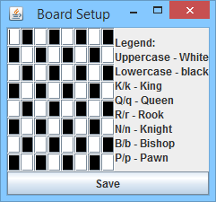

# Chess-AI
Author: Adam Balint

This repo contains an implementation of chess with an AI for a course project. The AI uses a Minimax Tree with Alpha-Beta pruning.

## Running the Program
1. Download the jar file
2. run `java -jar Chess_Project.jar`
3. Enjoy

## Program Usage
The program consists of 3 screens: steup, board configuration, and the game screen.

### Setup Screen
The setup screen is the place where you can choose how to set up your game. This includes selecting players and AI, AI level and piece colors. The picture below outlines the different fields.

1. Allows for selection between an AI or Human Player
1. Select the ply depth used by the AI
1. Select if the AI should use smart ply
   * Smart ply increases the ply by 1 if there are less than 12 pieces on the board
1. Randomize who takes black and who takes white
1. Generate a custom starting board
1. Start the game
1. Exit the program

### Board Configuration Screen
This screen allows for the user to configure a custom board layout. 

Each of the black and white squares are a text field. Type in the pieces in the desired position according to the legend. Click save and then press the start game button on the setup to start the game with the saved board. If it is decided that a custom board is not needed, then the board setup can be cancelled by closing the window.

Note: The board will only be used one time.

Note 2: The black pieces always go at the top, and the white always at the bottom.

### Game Screen
This screen is seen once the game starts. The game screen consists of 2 main components, the board on the left and the player information on the right. 

1. The player colour and whether it is a person (P) or an AI (A)
1. The turn indicator - 4 different versions described below
1. The container that holds the captured pieces
1. The game board where moves can be made and viewed

Additionally, the turn indicator has additional icons that may appear. These are explained below.

| Icon | Meaning | Obtained when |
| ------------ | ------------- | ------------- |
|   | Normal Turn | None of the events below is happening |
|  | Check | The king is being attacked by the enemy player |
|  | Checkmate | The king is being attached by the enemy player, and the current player is unable to defend. This is the end of the game |
|  | Stalemate | The game has no moves that can achieve victory for either player |

Making moves is simple. Once a piece is selected, the available moves will be shown with a green square. Once one of the green squares are clicked, the piece will move, and the other player will have a chance to move.

## Known Issues
A known problem is that when two AIs are playing against each other at the same ply level, then they are likely to get stuck in a move loop. Another known problem is that when the player has only a few pieces, the AI sometimes has difficulty getting the player in checkmate.

## Troubleshooting
If the board is displayed as shown in the picture, then the jar file is not in the same directory as the images folder. To fix, place the jar into the folder containing the images folder (shown below) and then run the jar again.

